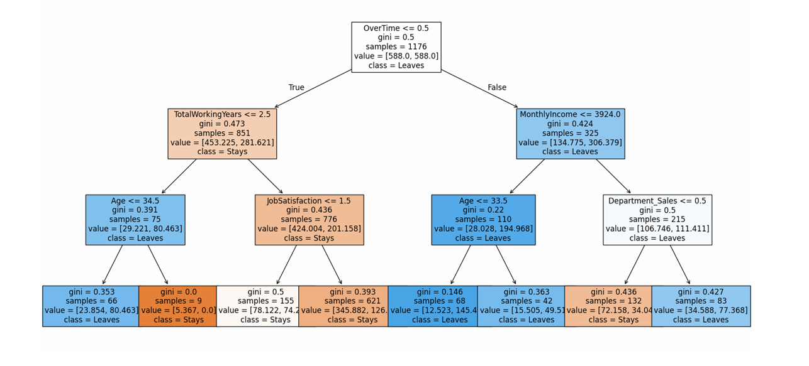
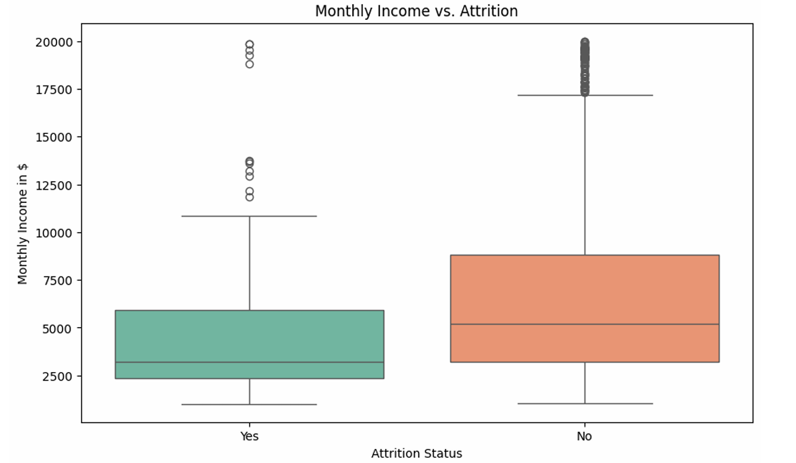
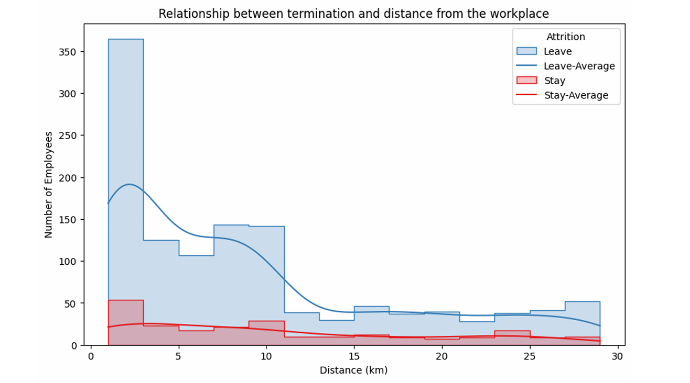
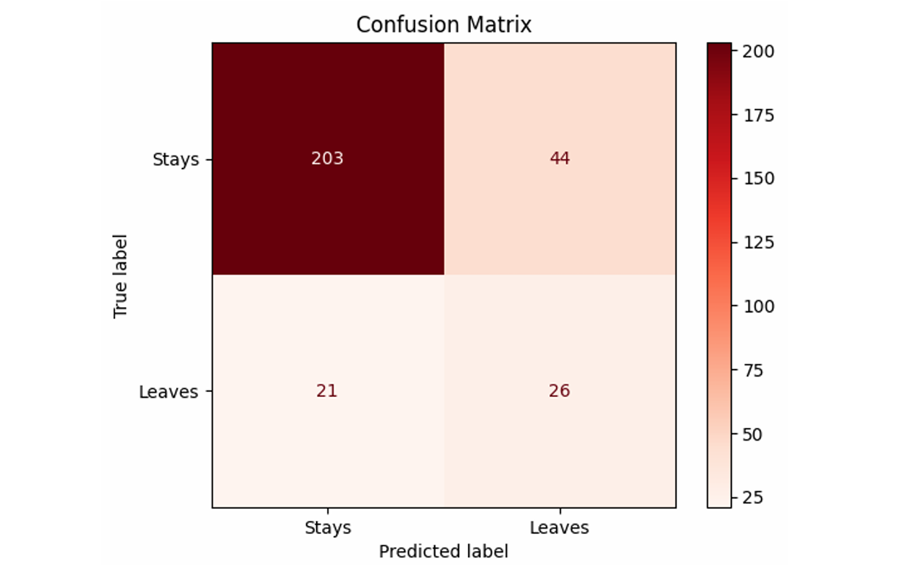

# Employee Attrition Analysis & Prediction
**An Early-Warning System for Data-Driven HR Retention**

 

## Executive Summary

This project delivers a data-driven approach to mitigating employee turnover. Using the IBM HR dataset, I developed a **Weighted Decision Tree** model that identifies **55% of at-risk employees** (Recall). This allows HR to transition from reactive hiring to proactive retention, addressing potential resignations before they impact the business.

The model identifies **OverTime** as the primary factor for attrition

 

## Business Problem

High attrition is more than just a HR metric — it's a massive financial drain. 
* **The Cost:** Recruitment and onboarding for a single position can cost up to 150% of an employee's annual salary.
* **The Risk:** Loss of institutional knowledge and decreased team morale.
* **The Goal:** Build a predictive tool that flags high-risk individuals, enabling targeted intervention.

 

## Methodology

1. **Data Sanitization:** Handled the IBM HR dataset, ensuring integrity and encoding categorical variables.
2. **Exploratory Analysis (EDA):** Pinpointed the "red flags" for resignation (Overtime, Tenure, and Compensation).

The analysis shows that **Monthly Income** and **Distance from Home** significantly impact employee decisions.

3. **Class Balancing:** Addressed the imbalanced nature of the data (fewer "Leavers" than "Stayers") using balanced class weights.
4. **Model Selection:** Prioritized **Recall over Accuracy** to ensure the widest possible safety net for the business.

 

## Skills

* **Stack:** Python (Pandas, NumPy, Scikit-Learn)
* **Visuals:** Seaborn & Matplotlib for business-ready storytelling.
* **ML Focus:** Handling Imbalanced Data, Feature Importance, and Model Evaluation (Confusion Matrix).

 

## Results

### Model Performance 
The Weighted Decision Tree achieved an **accuracy of 77.89% and a Recall of 55%**. This specific focus on recall ensures that more than half of at-risk employees are identified for proactive retention talks. 

The model successfully identifies **55% of actual resignations**.

 

## Business Recommendation

1. Reduce Overtime / Workload Management: Implement better compensation or reduce excessive hours, as overtime is the most reliable "red flag" for attrition.

2. Early Career Support: Focus mentoring and career path programs on the "Early Career" segment, specifically within the first 30 months of employment.

3. Commute Mitigation: Offer flexible remote work options or travel subsidies for distant employees to address the "pain point" of long commutes.
